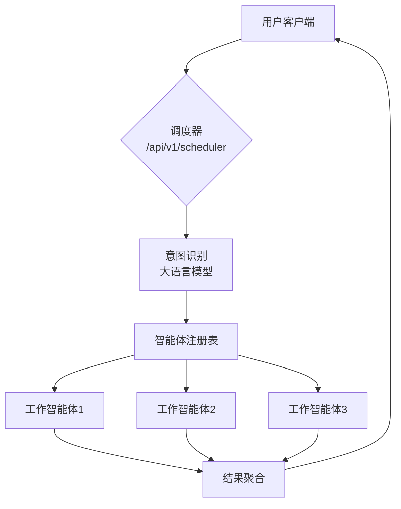

# Agent Manager System

智能体管理系统，用于协调不同类型智能体之间的调用和通信。

## 目录

- [系统架构](#系统架构)
- [系统特性](#系统特性)
- [技术栈](#技术栈)
- [安装](#安装)
- [运行](#运行)
- [API接口文档](#api接口文档)
  - [智能体管理接口](#智能体管理接口)
  - [调度智能体接口](#调度智能体接口)
  - [工作智能体接口](#工作智能体接口)
- [智能体类型](#智能体类型)
- [模块化设计](#模块化设计)
- [统一消息协议](#统一消息协议)
- [并发处理](#并发处理)
- [错误处理](#错误处理)
- [配置](#配置)
- [扩展新的智能体模块](#扩展新的智能体模块)

## 系统架构



### 架构流程说明

1. **用户请求**：用户通过HTTP请求向调度器发送自然语言查询
2. **意图识别**：调度器调用大语言模型解析用户意图，确定需要调用的工作智能体
3. **智能体调度**：根据意图识别结果，从注册表中获取对应的工作智能体信息
4. **任务执行**：并发调用各个工作智能体执行具体任务
5. **结果聚合**：将所有工作智能体的执行结果聚合后返回给用户

## 系统特性

1. **智能体消息传递**：实现智能体之间的消息传递
2. **多类型智能体支持**：支持不同类型智能体的接入
3. **统一接口**：提供统一的接口供外部调用
4. **动态管理**：支持智能体的动态添加和删除
5. **生命周期管理**：智能体注册/心跳/状态跟踪
6. **通信规范**：统一消息格式与路由协议
7. **并发执行**：所有请求并发执行
8. **模块化设计**：支持独立智能体模块开发
9. **外部智能体集成**：支持从外部API同步智能体信息
10. **智能意图识别**：使用大语言模型进行智能意图识别

## 技术栈

- [FastAPI](https://fastapi.tiangolo.com/): 现代、快速（高性能）的Web框架
- [Pydantic](https://docs.pydantic.dev/): 数据验证和设置管理
- [Qwen2.5](https://help.aliyun.com/zh/qwen/): 阿里通义千问大语言模型
- [HTTPX](https://www.python-httpx.org/): 异步HTTP客户端
- [Python 3.8+](https://www.python.org/): 编程语言

## 安装

```bash
# 克隆项目
git clone <repository-url>
cd agentManager

# 创建虚拟环境（推荐）
python -m venv venv
source venv/bin/activate  # Linux/Mac
# 或
venv\Scripts\activate  # Windows

# 安装依赖
pip install -r requirements.txt
```

## 运行

```bash
# 开发模式运行
uvicorn main:app --reload

# 生产模式运行
uvicorn main:app --host 0.0.0.0 --port 8000
```

访问 `http://localhost:8000/docs` 查看自动生成的API文档。

## API接口文档

### 智能体管理接口

#### 注册新智能体

- **URL**: `POST /api/v1/manager/agents/`
- **描述**: 注册一个新的智能体到系统中
- **请求体**:
  ```json
  {
    "name": "string",           // 智能体名称
    "description": "string",    // 智能体描述
    "agent_type": "scheduler|worker",  // 智能体类型
    "capabilities": ["string"], // 智能体能力列表
    "source": "internal|external" // 智能体来源（可选，默认为internal）
  }
  ```
- **响应**:
  ```json
  {
    "name": "string",
    "description": "string",
    "agent_type": "scheduler|worker",
    "capabilities": ["string"],
    "id": "string",             // 智能体唯一标识
    "status": "active|inactive|offline",  // 智能体状态
    "source": "internal|external", // 智能体来源
    "created_at": "datetime",
    "last_heartbeat": "datetime"
  }
  ```

#### 获取智能体列表

- **URL**: `GET /api/v1/manager/agents/`
- **描述**: 获取系统中所有智能体的列表，支持按类型和状态过滤
- **参数**:
  - `agent_type` (可选): 过滤智能体类型 (scheduler|worker)
  - `status` (可选): 过滤智能体状态 (active|inactive|offline)
- **响应**: 智能体对象数组

#### 获取指定智能体

- **URL**: `GET /api/v1/manager/agents/{agent_id}`
- **描述**: 获取指定ID的智能体详细信息
- **参数**:
  - `agent_id`: 智能体唯一标识
- **响应**: 智能体对象

#### 更新智能体信息

- **URL**: `PUT /api/v1/manager/agents/{agent_id}`
- **描述**: 更新指定智能体的信息
- **参数**:
  - `agent_id`: 智能体唯一标识
- **请求体**:
  ```json
  {
    "name": "string",           // (可选) 智能体名称
    "description": "string",    // (可选) 智能体描述
    "capabilities": ["string"], // (可选) 智能体能力列表
    "status": "active|inactive|offline"  // (可选) 智能体状态
  }
  ```
- **响应**: 更新后的智能体对象

#### 注销智能体

- **URL**: `DELETE /api/v1/manager/agents/{agent_id}`
- **描述**: 从系统中移除指定的智能体
- **参数**:
  - `agent_id`: 智能体唯一标识
- **响应**:
  ```json
  {
    "message": "Agent unregistered successfully"
  }
  ```

#### 发送心跳

- **URL**: `POST /api/v1/manager/agents/{agent_id}/heartbeat`
- **描述**: 智能体发送心跳以表明其在线状态
- **参数**:
  - `agent_id`: 智能体唯一标识
- **请求体**:
  ```json
  {
    "agent_id": "string",       // 智能体ID
    "timestamp": "datetime"     // 心跳时间
  }
  ```
- **响应**:
  ```json
  {
    "message": "Heartbeat received"
  }
  ```

### 调度智能体接口

#### 处理用户查询

- **URL**: `POST /api/v1/scheduler/process_query`
- **描述**: 接收用户自然语言查询，解析意图并返回需要调用的工作智能体列表
- **请求体**:
  ```json
  {
    "query": "string",          // 用户查询
    "session_id": "string",     // (可选) 会话ID
    "context": {}               // (可选) 上下文信息
  }
  ```
- **响应**:
  ```json
  {
    "task_id": "string",        // 任务ID
    "session_id": "string",     // 会话ID
    "target_agents": [          // 目标智能体列表
      {
        "id": "string",         // 智能体ID
        "name": "string",       // 智能体名称
        "description": "string", // 智能体描述
        "source": "internal|external" // 智能体来源
      }
    ],
    "response": "string"        // 响应内容
  }
  ```

### 工作智能体接口

#### 执行任务

- **URL**: `POST /api/v1/worker/execute/{agent_id}`
- **描述**: 在指定的工作智能体上执行任务
- **参数**:
  - `agent_id`: 智能体唯一标识
- **请求体**:
  ```json
  {
    "task_id": "string",        // 任务ID
    "input_data": {},           // 输入数据
    "metadata": {}              // (可选) 元数据
  }
  ```
- **响应**:
  ```json
  {
    "task_id": "string",        // 任务ID
    "agent_id": "string",       // 智能体ID
    "output_data": {},          // 输出数据
    "execution_time": 0.0,      // 执行时间(秒)
    "status": "string"          // 执行状态
  }
  ```

## 智能体类型

系统支持多种类型的智能体：

1. **默认内置智能体**：
   - **初二数学助手**：专门解答初二下学期数学问题的智能体
   - **古诗助手**：专门处理古诗相关问题的智能体
   - **生物学助手**：专门解答生物学相关问题的智能体

2. **外部智能体**：
   - 通过外部API同步的智能体
   - 支持动态扩展和更新

## 模块化设计

系统采用模块化设计，每个智能体都是一个独立的模块，可以轻松扩展和维护：

- **数学智能体模块** (`agents/math_agent.py`)：专门处理数学问题的智能体模块
- **古诗智能体模块** (`agents/poetry_agent.py`)：专门处理古诗问题的智能体模块
- **生物智能体模块** (`agents/biology_agent.py`)：专门处理生物问题的智能体模块
- **调度器模块** (`agents/scheduler.py`)：负责解析用户意图并调度合适的智能体
- **工作智能体模块** (`agents/worker.py`)：处理具体任务执行
- **管理模块** (`agents/manager.py`)：负责智能体的注册、查询、更新等管理功能
- **外部智能体处理器** (`agents/external_agent_processor.py`)：处理外部智能体的任务执行

其他模块通过引用方式使用这些智能体，保持了代码的低耦合和高内聚。

## 统一消息协议

系统使用基于JSON的统一消息协议，所有消息都遵循以下格式：

```json
{
  "id": "string",               // 消息唯一标识
  "source_agent_id": "string",  // 源智能体ID
  "target_agent_id": "string",  // 目标智能体ID
  "content": {},                // 消息内容
  "timestamp": "datetime",      // 消息时间戳
  "metadata": {}                // (可选) 消息元数据
}
```

## 并发处理

所有请求都支持并发执行，前端可以根据调度器返回的[target_agents](file:///d:/python_codes/agentManager/schemas/agent.py#L51-L51)列表并发调用各个工作智能体的执行接口。

## 错误处理

系统使用标准HTTP状态码表示请求结果：
- `200`: 请求成功
- `400`: 请求参数错误
- `404`: 资源未找到
- `500`: 服务器内部错误

详细的错误信息会在响应体的`detail`字段中提供。

## 配置

系统通过环境变量进行配置：
- `QWEN_API_KEY`: Qwen API密钥
- `QWEN_MODEL_NAME`: 使用的模型名称，默认为`qwen2.5-32b`
- `QWEN_API_BASE`: Qwen API基础URL（可选）
- `EXTERNAL_API_URL`: 外部智能体API地址（可选，默认为`http://192.168.1.15:8000/api/v1/agents`）

## 扩展新的智能体模块

要创建新的智能体模块，请按照以下步骤操作：

1. 在 `agents/` 目录下创建新的智能体文件，如 `new_agent.py`
2. 定义智能体配置和注册函数
3. 在系统启动时注册该智能体
4. 在调度器中添加对该智能体的识别逻辑
5. 在工作智能体中添加具体的任务处理逻辑